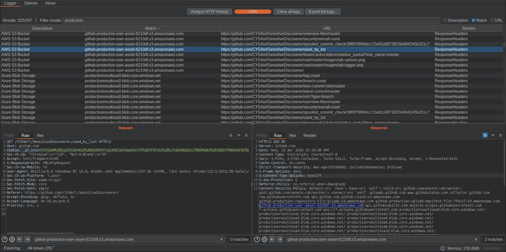
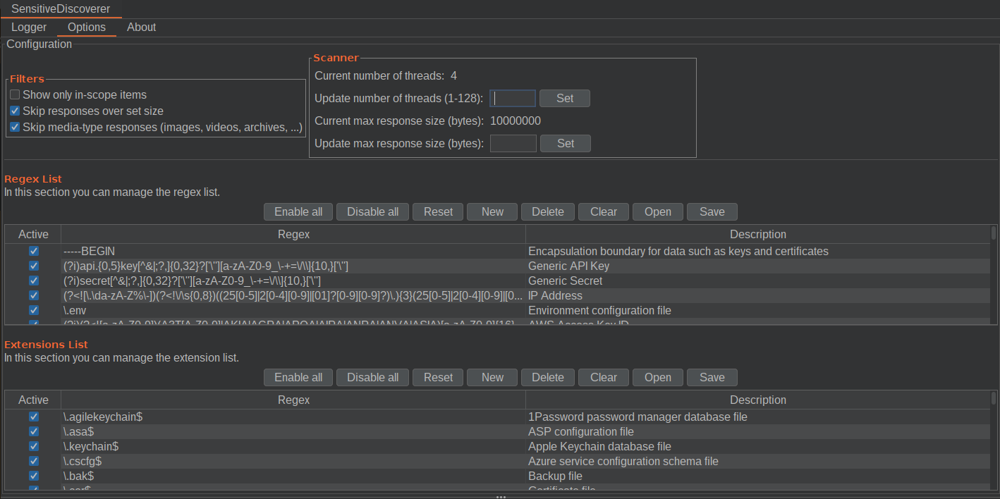

# Sensitive Discoverer

> Burp Suite extension to scan for sensitive strings in HTTP messages

<!-- TOC -->
* [Sensitive Discoverer](#sensitive-discoverer)
  * [Introduction](#introduction)
    * [Features](#features)
    * [Screenshots](#screenshots)
    * [About the used regexes](#about-the-used-regexes)
    * [Multi-step regex matching](#multi-step-regex-matching)
  * [Installation](#installation)
    * [Using the BApp Store](#using-the-bapp-store)
    * [Manual install](#manual-install)
  * [Usage](#usage)
    * [Importing Lists](#importing-lists)
    * [Importing Lists - Advanced](#importing-lists---advanced)
  * [How to compile from source code](#how-to-compile-from-source-code)
    * [Using Maven from CLI](#using-maven-from-cli)
  * [About us](#about-us)
  * [References](#references)
<!-- TOC -->

## Introduction

Burp Suite is a useful tool used to do web application security testing.
While providing a lot of useful functionalities; when it comes to scanning the content inside HTTP messages against
many different patterns, this becomes a tedious process.

`Sensitive Discoverer` is a Burp Suite extension that solves this problem.
With this extension you can automatically and quickly search for sensitive strings in all HTTP messages.

Behind the curtains it all comes down to a list of Regular Expressions that get matched against the content in each HTTP message.
The extension is available with a pre-defined set of Regular Expressions divided into useful sections; but you can also add your custom lists if preferred.

### Features

- Multithreaded scan of messages
- Pre-defined sets of regexes
- Many filters to skip irrelevant messages
- Customizable regexes lists
- Export findings to CSV/JSON files
- Import/Export regexes lists from CSV/JSON files
- Multi-step regex matching

### Screenshots

The **Logger tab**, as the Main page, contains the results of the scans:



The **Options tab** where to configure options and filters for the scanner:



### About the used regexes

We aim to provide a default set of regexes that can be used in as many cases as possible without numerous false positives.

We write and refine many regexes directly. If external sources are to be credited, they will be mentioned appropriately in the [References](#references) section or directly in the regex lists.

To improve the matching results and reduce the scan time, each HTTP Proxy's message is divided into sections that can be matched independently.
As of now, there are five sections:

- Request
  - Request URL
  - Request Headers
  - Request Body
- Response
  - Response Headers
  - Response Body

The extension works with two lists of regexes.
One list is for general regexes, which, by default, only match within the Response sections;
The other is for filename extensions and, by default, only matches against the Request URL.

### Multi-step regex matching

This extension supports adding a second regex to refine the match without degrading performances.
Suppose we want to match all bucket URLs of some object storage provider, such as AWS S3 Buckets.
These URLs all have a common suffix, for example, "s3.amazonaws.com", and an arbitrary bucket name in front.

With a single regex, you can't first match the suffix and only then the bucket name.
You can write a fast regex that only matches the suffix or a really slow one that matches everything, such as with `\w+\.s3\.amazonaws\.com`.
The problem is in matching from left to right. When `\w+` comes first, almost everything is matched, resulting in a really slow regex.
The alternative of matching only the suffix is fast, but doesn't show us the bucket name in the results.

Our approach introduces a "Refiner Regex" that's only applied after the main regex has matched.
This refiner regex is applied on a small region before the match. By default, this region size is set to 64 bytes.
With this feature, we can trivially solve the previous problem using `s3\.amazonaws\.com` as the main regex and
`\w*\.` as the refiner regex. This feature reduces scan times while also producing valuable matches.

## Installation

### Using the BApp Store

The extension is available [in the BApp Store](https://portswigger.net/bappstore/81e073a640964b2ea3af0da93d048dbd) inside Burp's Extender tab

### Manual install

To install the "Sensitive Discoverer" extension manually:

1. Download newest "Sensitive Discoverer" from the [GitHub Release page](https://github.com/CYS4srl/SensitiveDiscoverer/releases).
2. In BurpSuite, go to Extender -> Extension. Click Add. Ensure "Extension type" is set to Java and set the path to the .jar downloaded in step 1.
3. "Sensitive Discoverer" should appear inside Burp Extension list, and as a new tab in the top menu.

## Usage

The default configuration already has a list of regular expressions and file extensions.

To see the predefined list go to the Options tab. There you can choose which of them to activate, and you can also insert your own regular expressions.

These are the actions available to manage the lists:

- **Enable all**: disable all the regexes in the current section.
- **Disable all**: enable all the regexes in the current section.
- **List > Reset default list**: the list will be reset to the default list.
- **List > Clear list**: the list will be emptied.
- **List > Open list...**: a pop-up will appear to import a list of regex or extensions from a `csv` or `json` file. For the required file format, refer to the [Importing Lists](#importing-lists) section.
- **List > Save list...**: a pop-up will appear to save the current list of regex to a `csv` or `json` file.
- **Regex > New regex**: a pop-up will appear to insert a new regex.
- **Regex > Edit selected**: a pop-up will appear to modify the currently selected regex.
- **Regex > Delete selected**: the currently selected regex will be deleted from the list.

After customizing the lists it is now possible to start scanning for sensitive information inside HTTP messages.
The extension parses all HTTP messages captures up to that moment in the Proxy tab, and tries to match all active patterns.

### Importing Lists

Using the "Open list" and "Save list" buttons it's possible to import custom lists, and save the current list to a file.

Both `CSV` and `JSON` files with their respective extensions are supported.

- For **CSV** files, the first line represent the header line `"description","regex"` and each next line represents an entry. Entries must have the following format: `"Description","Regex"`. The quotation marks and the comma are required. Any double-quote inside the fields must be escaped with another double-quote. E.g.:

  ```csv
  "description","regex"
  "Google e-mail","\w+@gmail.com"
  ```

- For **JSON** files, the file must be in the following format:
  
  ```json
  [
    {
      "description": "Google e-mail",
      "regex": "\\w+@gmail.com"
    }
  ]
  ```

> [!IMPORTANT]  
> Regexes must be compliant with Java's Regexes Style. If in doubt, use [regex101](https://regex101.com/) with the `Java 8` flavour to test regexes.

> [!NOTE]
> Importing a regex list in this limited format will result in the default section of `res` to be used for all regexes.
Additionally, there will be no refiner regex. 

### Importing Lists - Advanced

In the lists, it's also possible to specify the refiner regex and the sections the regexes should match.
If no section is specified, no sections are going to be enabled.
If no refiner regex is specified, no refiner regex will be used.

Each HTTP item composed of a request and a response is divided into the following matchable sections:

- `req_url`: Request URL;
- `req_headers`: Request headers without the request line (first line);
- `req_body`: Request body;
- `res_headers`: Response headers without the status line (first line);
- `res_body`: Response body;

The following sections groups are also available to make things easier and more readable:

- `req`: req_url + req_headers + req_body
- `res`: res_headers + res_body
- `all`: req + res

To specify the sections to match use the following format:

- For **CSV** files, add a `sections` column and for each row add the list of sections to be matched as a string with sections delimited by the character `|`:

  ```csv
  "description","regex","refinerRegex","sections"
  "Google e-mail","@gmail\.com","\w+$","req|res_body"
  ```
  
- For **JSON** files, add a `sections` field containing the array of sections to be matched as strings:

  ```json
  [
    {
      "description": "Google e-mail",
      "regex": "@gmail\\.com",
      "refinerRegex": "\\w+$",
      "sections": [ "req", "res_body" ]
    }
  ]
  ```

## How to compile from source code

### Using Maven from CLI

Run the following command:

```bash
mvn clean package
```

The compiled extension will be in the "/target" folder.

## About us

Since 2014 we have been working with our customers to shield their critical business infrastructures. We are qualified security specialists with a strong commitment to addressing our clients' needs, and keeping them secured against today's cyber threats.

Check out [our site](https://cys4.com/) and [our blog](https://blog.cys4.com/) for more information.

## References

The following is a list of sources for some regexes used in this extension. Many thanks to all!

- https://github.com/eth0izzle/shhgit
- https://github.com/streaak/keyhacks

Additional references are kept directly in the regexes lists files.
