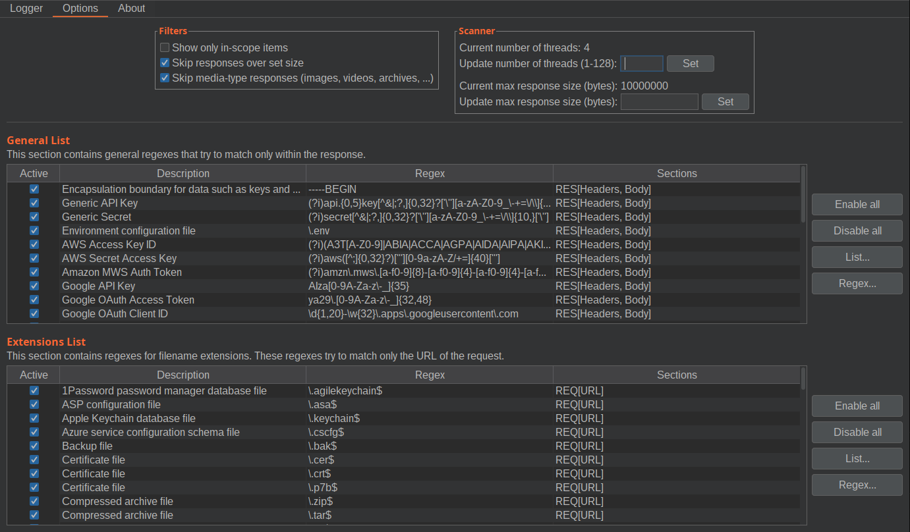

# SensitiveDiscoverer

> Burp Suite extension to scan for sensitive strings in HTTP messages

<!-- TOC -->
* [SensitiveDiscoverer](#sensitivediscoverer)
  * [Introduction](#introduction)
    * [Features](#features)
    * [Screenshots](#screenshots)
    * [About the used regexes](#about-the-used-regexes)
  * [Installation](#installation)
    * [Using the BApp Store](#using-the-bapp-store)
    * [Manual install](#manual-install)
  * [Usage](#usage)
    * [Importing Lists](#importing-lists)
  * [How to compile from source code](#how-to-compile-from-source-code)
    * [Using Maven from CLI](#using-maven-from-cli)
  * [About us](#about-us)
  * [References](#references)
<!-- TOC -->

## Introduction

Burp Suite is a useful tool used to do web application security testing. While Burp Suite provides a lot of functionalities, it does not offer the opportunity to scan for particular pattern or file extensions inside HTTP messages. Checking every message by hand can be a very tedious process.

`SensitiveDiscoverer` is a Burp Suite extension that solves this problem. With this extension you can automatically search sensitive strings in HTTP messages.

It uses a list of Regular Expressions and File Extensions to match for in each message. The plugin is available with a pre-defined set of Regular Expression and File Extensions, but you can also add your custom lists.

### Features

- Multithreaded scan of messages
- Pre-defined set of regex
- Many filters to skip irrelevant messages
- Customizable regexes lists
- Import/Export regexes with CSV files

### Screenshots

Main page with the results of the scan:


Options tab to configure filters and scanner options:



### About the used regexes

We aim to provide a default set of regexes that can be used in as many cases as possible without numerous false positives.

As the source, many regexes are written by us, and any other should have the appropriate mention in the [References](#references) section.

Each Proxy list row is divided into sections to improve the matching results and reduce the scan times. As of now, there are five sections:

- Request
  - Request URL
  - Request Headers
  - Request Body
- Response
  - Response Headers
  - Response Body

The extension works with two lists of regexes. One list is for general regexes, which only matches within the Response sections; The other is for filename extensions and only matches the Request URL.

## Installation

### Using the BApp Store

The extension is available in the BApp Store inside Burp's Extender tab

### Manual install

To install the SensitiveDiscoverer extension manually:

1. Download newest SensitiveDiscoverer from the Release page.
2. Go to Extender -> Extension. Click Add. Set Extension type to Java. Set the path of the (.jar) to the file downloaded at step 1.
3. SensitiveDiscoverer should appear inside Burp Extension list, and a new tab will appear.

## Usage

The default configuration already has a list of regular expressions and file extensions.

To see the predefined list go to the Options tab. There you can choose which of them to activate, and you can also insert your own regular expressions.

These are the actions available to manage the lists:

- **Enable all**: disable all the regexes in the current section.
- **Disable all**: enable all the regexes in the current section.
- **Reset default list**: the list will be reset to the default list.
- **Clear list**: the list will be emptied.
- **Open list**: a pop-up will appear to import a list of regex or extensions from a `csv` or `json` file. For the required file format, refer to the [Importing Lists](#importing-lists) section.
- **Save list**: a pop-up will appear to save the current list of regex to a `csv` or `json` file.
- **New regex**: a pop-up will appear to insert a new regex or extension.
- **Delete regex**: the currently selected row will be deleted from the list.
- **Edit regex**: a pop-up will appear to modify the currently selected row.

After customizing the lists it is now possible to start scanning for sensitive information inside HTTP messages. The extension parses all http request generated up to that moment in the Proxy tab, and tries to match all active patterns.

### Importing Lists

Using the "Open list" and "Save list" buttons it's possible to import custom lists, and save the current list to a file.

Both `CSV` and `JSON` files with their respective extensions are supported.

- For **CSV** files, the first line represent the header line `"description","regex"` and each next line represents an entry. Entries must have the following format: `"Description","Regex"`. The quotation marks and the comma are required. Any double-quote inside the fields must be escaped with another double-quote. E.g.:

  ```csv
  "description","regex"
  "Google e-mail","\w+@gmail.com"
  ```

- For **JSON** files, the file must be in the following format:
  
  ```json
  [
    {
      "description": "Google e-mail",
      "regex": "\\w+@gmail.com"
    }
  ]
  ```

Regexes must be compliant with the Java's Regexes Style. If in doubt, use [regex101](https://regex101.com/) with the `Java 8` flavour to test regexes.

## How to compile from source code

The extension was compiled with OpenJDK 17.

The BApp can be compiled with Maven by following these steps:

1. View > Tool Windows > Maven.
2. On the new right panel expand the Lifecycle folder.
3. Double-click on "Install".

The compiled extension will be in the "/target" folder.

### Using Maven from CLI

As an alternative, run the following command:

```bash
mvn clean package
```

## About us

Since 2014 we have been working with our customers to shield their critical business infrastructures. We are qualified security specialists with a strong commitment to addressing our clients' needs, and keeping them secured against today's cyber threats.

Check out [our site](https://cys4.com/) and [our blog](https://blog.cys4.com/) for more information.

## References

The following is a list of sources for some regexes used in this extension. Many thanks to all!

- https://github.com/eth0izzle/shhgit
- https://github.com/streaak/keyhacks
